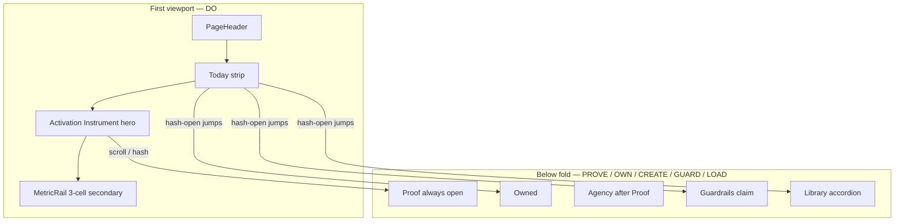
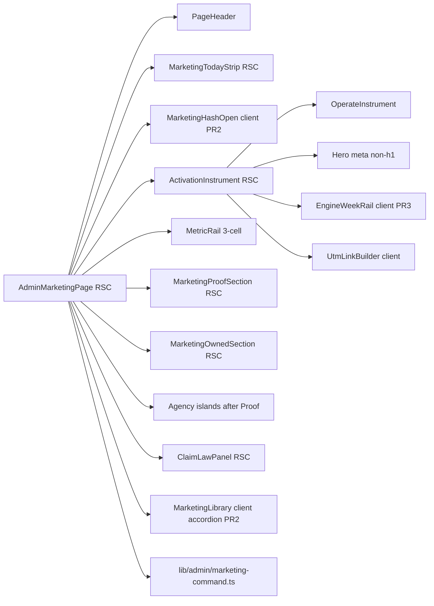
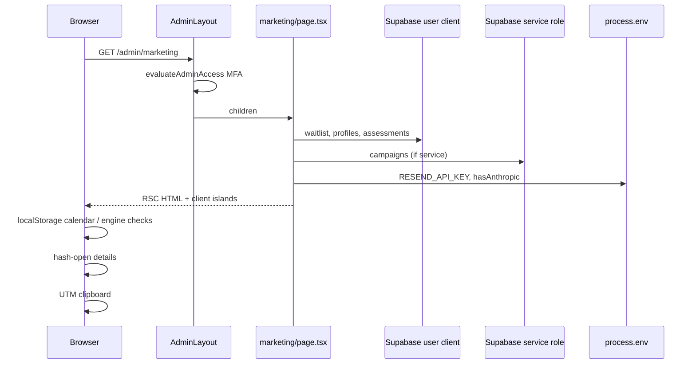
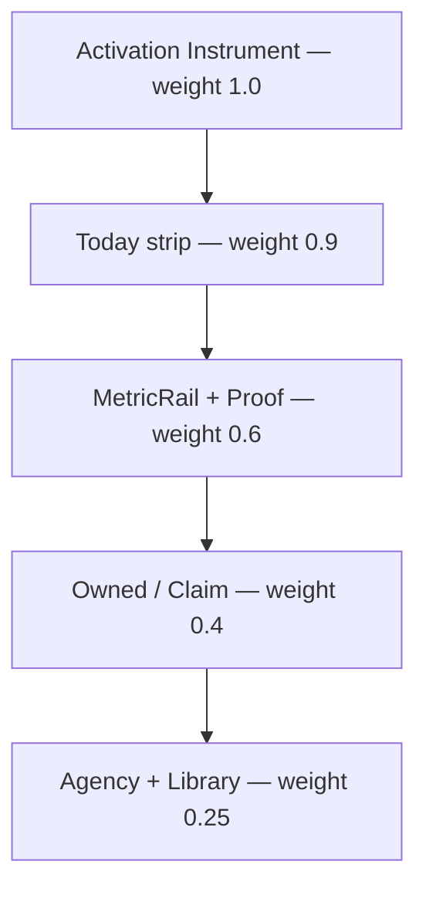

# HōMI Marketing Command Center — UX/UI Redesign + Architecture

| Field | Value |
|-------|--------|
| **Document** | Design — Marketing Command Center v2 |
| **Author** | TBD (Architect) |
| **Date** | 2026-08-12 |
| **Status** | Draft (rev 3 — residual CTA / a11y / Sunday polish) |
| **Product** | HōMI (Decision Companion / Decision Readiness Intelligence) |
| **Surface** | `/admin/marketing` · `app/(product)/admin/marketing/page.tsx` |
| **Repo** | Homi-Tech-Production / `HoMI_Tech_Github_Build` |
| **Brand lock** | Navy `#0a1628`, cyan / emerald / gold · zero-affiliate · educational guidance only |

---

## Overview

The shipped Marketing Command Center (`feat(admin): marketing command center`, commit `8543110` on `main`, later extended by `6ef26a6` agency suite) already aggregates north-star activations, funnel, email OS, GTM engine slate, UTM builder, claim law, and the full `public/marketing/` library into one admin page. Functionally it is complete; operationally it fails the solo-founder job: **“What should I do this week to create activations?”** is not answerable in the first viewport. Twelve-plus equal glass cards compete at the same weight; the LinkedIn engine, scoreboard ritual, and claim law sit below a long agency/analytics stack; the library dumps every section as an equal grid.

This design redesigns hierarchy, progressive disclosure, and visual language **without new heavy deps or new product surfaces**. It introduces a single signature structure—the **Activation Instrument**—built on existing operate chrome (`OperateInstrument`, `OperateHeroMeta`, `MetricRail`, `AttentionStrip`, `score-numeral`, `panel-focus`), a **Today** ops strip (sticky desktop / static mobile), and collapsible secondary zones (Owned detail, Guardrails, Library, Agency). Data contracts, admin MFA gating, and catalog SoT in `lib/admin/marketing-command.ts` stay; only presentation, density, and optional local engine-checklist state change.

**No feature flag for v2.** Admin-only UI ships on normal deploy with git revert as rollback. Do not invent `ADMIN_MARKETING_V2` cookies or env toggles outside `lib/flags.ts`’s `NEXT_PUBLIC_FF_* === "true"` pattern—and do not add a flag for this page.

---

## Background & Motivation

### Current state (SHIPPED)

| Layer | Path / symbol | Role today |
|-------|----------------|------------|
| Page (RSC) | `app/(product)/admin/marketing/page.tsx` (~1028 lines) | Fetches waitlist, profiles, assessments, campaigns (service role), builds attention + metrics + funnel |
| Catalog | `lib/admin/marketing-command.ts` | `MARKETING_LOCK`, `ENGINE_WEEK_POSTS`, `LIBRARY_SECTIONS`, `QUICK_ACTIONS`, claim lists, `buildUtmUrl` |
| Agency helpers | `lib/admin/marketing-agency.ts` | Calendar localStorage (`CALENDAR_STORAGE_KEY = "homi-content-calendar"`), AI templates |
| Client islands | `UtmLinkBuilder`, `MarketingLibrary`, `AudienceInsights`, `SocialContentStudio`, `PostCaptionWriter`, `ContentCalendar` | Copy, AI, localStorage calendar |
| Operate shell | `app/(product)/admin/layout.tsx` | MFA/session via `evaluateAdminAccess`; `data-density="compact"`; Growth nav group |
| Primitives | `PageHeader`, `MetricRail`, `AttentionStrip`, `OperateInstrument`, `OperateHeroMeta`, `ActionDock`, `SectionHeader`, `FunnelBars`, `BarSeries`, `RankedBars`, `Sparkline` | Direction A cockpit language |
| GTM SoT | `public/marketing/` + `HOMI-SOLO-GTM-OS.md` §1 | Locked ICP, LinkedIn 90d, PH=No, north star = weekly activations |
| Live URL | https://homitechnology.com/admin/marketing | Admin-gated |

### Pain points (mapped to code)

1. **Flat hierarchy** — Mission lock glass → AttentionStrip → MetricRail → Quick actions → agency suite → engine/UTM → activations → funnel → email → revenue → demand → claim → library. Every block is `glass p-6` with a full `SectionHeader`. Nothing is “the instrument.”
2. **Founder weekly job not first-viewport** — Engine slate and UTM sit after `AudienceInsights` / `SocialContentStudio` / `PostCaptionWriter` / `ContentCalendar` (page.tsx ~555–565 before engine ~567). The weekly job (post LinkedIn slate, tag UTMs, load emails, fill Sunday scoreboard) loses to tooling.
3. **Library dump** — `MarketingLibrary` renders all `LIBRARY_SECTIONS` open as equal 3-col grids; ~30+ cards, no collapse.
4. **No progressive disclosure** — Full server payload + multiple client islands hydrate at once; mobile is a long scroll of dense glass.
5. **Brand distinctiveness** — Uses glass correctly but not the personal-dashboard **instrument** surface already in `globals.css` (`.dash-instrument`) and `OperateInstrument`. Looks like “another admin KPI page,” not HōMI operate.
6. **Activation path + claim law buried** — Claim panels and support script after revenue/demand; activation path only via quick action + UTM.
7. **Engine checklist static** — `ENGINE_WEEK_POSTS` rows have Asset / UTM links only; no done state (unlike `ContentCalendar`, which already persists to `localStorage`).

### Why now

GTM OS §1 is locked (2026-08-12). Engine Week 1–2 is the active ritual. The command center must make that ritual **obvious and fast**, not merely document it.

---

## Goals & Non-Goals

### Goals

1. Answer **“what should I do this week to create activations?”** in the first viewport (Today strip + Activation Instrument).
2. Keep all twelve functional zones (mission, attention, metrics, engine, UTM, activation series/sources, funnel/channels/verdicts, email OS, revenue, waitlist interests, claim law, library)—re-weighted, not deleted.
3. One signature visual structure: **Activation Instrument** (score + sparkline + this-week engine rail).
4. Progressive disclosure: Today ops strip; secondary analytics and library collapsible by section.
5. Stay on HōMI navy field + cyan/emerald/gold; use existing type scale (`eyebrow`, `type-h2`, `score-numeral` / `.num`, `--font-score`, `--font-display`).
6. Server Components by default; client only for UTM copy, optional checkboxes, hash-open, existing agency islands, library accordion.
7. Desktop-first compact density; must not break mobile; keyboard / focus / `prefers-reduced-motion`.
8. Copy: plain founder language, active voice; never-say list is a **prohibition registry**, never claims.

### Non-Goals

- Full ESP / broadcast product
- Product Hunt launcher UI
- Mass social scheduling automation
- Public marketing site redesign
- Replacing PostHog
- New heavy UI libraries or chart stacks
- Weakening admin MFA / layout gate
- Mass-rewriting agency suite internals beyond **placement and default disclosure**
- Multi-device checklist sync (v2)
- New feature flags for layout rollout
- “This week” library pin UX (deferred / dropped for v2)

---

## Proposed Design

### Recommended architecture: **Hybrid C + progressive A**

| Alternative | Verdict |
|-------------|---------|
| **A** Single long page, refined hierarchy | Good base; still risks scroll fatigue without sticky ops |
| **A′ reorder-only** (MetricRail + AttentionStrip, no instrument) | **PR1 schedule fallback only** — see Alternatives |
| **B** Tabbed (Ops \| Metrics \| Library \| Claim) | Cleaner buckets; **hides** scoreboard numbers from ops ritual |
| **C** Two-column ops-left / analytics-right + sticky mission | Strong desktop; fragile with AdminSidebar sticky |
| **C′ light** (ActionDock sticky CTAs, no instrument) | Lighter; weaker brand signature |
| **Chosen: C′** | **Today strip** + **Activation Instrument hero** + **single-page sections** with collapsible secondary zones. No tabs. No new routes. |

Rationale: The founder job is one continuous weekly loop (create → distribute → measure → claim-check). Tabs split measure from act. A pure long page already failed hierarchy. C′ keeps one URL, reuses admin shell, and matches Direction A (`OperateInstrument` on personal dashboard).

### Locked page section order (PR1+)

Exact DOM order after redesign — **no ambiguity**:

1. `PageHeader`
2. `MarketingTodayStrip` (attention[0] + jump CTAs)
3. Full `AttentionStrip` **only if** `attention.length > 1` (secondary items only; see Attention contract)
4. `ActivationInstrument` (score + engine + UTM; id anchors `#engine`, `#utm-builder`)
5. `MetricRail` — **3 cells: Waitlist · Accounts · Paid** (not activations)
6. Quick action **chips** (all 8 `QUICK_ACTIONS` until founder culls)
7. `#proof` — activations 30d + last 10 sources + funnel/channels/verdicts (**always expanded**)
8. `#owned` — Email OS (+ conditional open) + revenue summary + demand
9. `#create` — Agency suite (AudienceInsights → SocialContentStudio → PostCaptionWriter → ContentCalendar), **default collapsed from PR2**; **PR1: still expanded but placed here after Proof**
10. `#claim` — Claim law never/prefer + support script
11. `#library` — `MarketingLibrary` accordion (`ops` open by default from PR2)

**Agency suite is after Proof, never between header and engine.** PR1 moves it after Proof even if still expanded; PR2 collapses it.

### Information architecture (zones → page regions)



| # | Functional zone (must keep) | Region | Default visibility |
|---|----------------------------|--------|--------------------|
| 1 | Mission lock | Instrument mission chips | Always (compact) |
| 2 | Attention / ops alerts | Today strip = `attention[0]`; full strip only for rest | Always primary via Today |
| 3 | North-star metrics | Instrument hero = activations 7d only; MetricRail = waitlist/accounts/paid | Always |
| 4 | Engine this week | Instrument right rail `#engine` | Always |
| 5 | UTM builder | Instrument right under engine `#utm-builder` | Always (compact) |
| 6 | Activation series + last 10 | `#proof` | Always expanded |
| 7 | Funnel + channels + verdict mix | `#proof` | Always expanded |
| 8 | Email OS | `#owned` | Open if Resend missing **or** (`waitlistTotal > 0` && no drafts && no sent)—match page attention; else summary + `<details>` |
| 9 | Revenue / tier mix | `#owned` | Summary KPIs visible; tier bars in `<details>` (PR2) |
| 10 | Waitlist interests | `#owned` | RankedBars visible (compact); no extra disclosure required |
| 11 | Claim law + support | `#claim` | Collapsed `<details>` from PR2; hash-open forces open |
| 12 | Categorized library | `#library` | Accordion: **`ops` open only**; no “this week” pin in v2 |

---

### Implementer contract (Activation Instrument + Today + Attention)

This subsection is normative for PR1–PR2. Do not re-litigate in code review without a design edit.

#### Instrument layout

```tsx
// Structure inside OperateInstrument
// Single document h1 = PageHeader "Marketing" only.
// Instrument title reuses .dash-hero-meta chrome WITHOUT a second h1.
<div className="dash-instrument-inner …">
  <p className="eyebrow">This week · LinkedIn engine</p>
  <div className="dash-hero-meta" role="group" aria-label="This week focus">
    {/* Prefer OperateHeroMeta once it accepts titleAs / headingLevel !== 1.
        Until then: same visual classes as OperateHeroMeta, non-heading title. */}
    <p className="/* match .dash-hero-meta h1 type scale — type-h2 or dash-hero-meta styles */">
      Create activations
    </p>
    <p>
      Post the slate, tag every link, load email drafts — then prove the numbers
      below.
    </p>
  </div>
  {/* Mission chips — single flex wrap row */}
  <div className="mt-3 flex flex-wrap gap-2">…chips…</div>

  {/* Grid: stack mobile; two columns from lg */}
  <div className="mt-6 grid gap-6 lg:grid-cols-[minmax(0,0.45fr)_minmax(0,0.55fr)]">
    <div>{/* score column */}</div>
    <div id="engine">{/* engine rail + #utm-builder */}</div>
  </div>
</div>
```

| Spec | Value |
|------|--------|
| Shell | `OperateInstrument` with dynamic `tint` |
| Tint | `COLORS.emerald` if `activationsLast7 > 0`; `COLORS.amber` if `accountsLast7 > 0 && activationsLast7 === 0`; else `COLORS.cyan` |
| Title block | **Visual peer of `OperateHeroMeta`** (`.dash-hero-meta` layout) — **must not render a second `<h1>`**. Page-level heading remains `PageHeader` → “Marketing” only. Options (prefer first that is cheap): (1) local markup with `<p>` / styled span matching `.dash-hero-meta h1` type scale; (2) extend `OperateHeroMeta` with optional `titleAs?: "h1" \| "h2" \| "p"` (default `"h1"` for dashboard) and pass `titleAs="p"` here. **Do not** call today’s `OperateHeroMeta` as-is on this page (it always emits `<h1>`). |
| Grid | `lg:grid-cols-[minmax(0,0.45fr)_minmax(0,0.55fr)]` — score left, engine+UTM right; single column below `lg` |
| Hero number | Activations 7d only — `score-numeral` / large `.num` |
| Sparkline | Show iff `activationSeries.length >= 2`; color `COLORS.emerald` |
| Rate line | `{accountsLast7} accounts → {activationsLast7} activations` + rate % if non-null |
| **No mini MetricRail inside instrument** | Waitlist / accounts / paid live only in the **secondary MetricRail under the instrument** |

#### Mission chips (from `MARKETING_LOCK`)

| Chip label (UI) | Source field | Format / max |
|-----------------|--------------|--------------|
| Channel | `channel` | Full string (e.g. “LinkedIn founder”) |
| PH | `phThisQuarter` | Prefixed `PH {value}` (e.g. “PH No”) |
| Hours | `hoursPerWeek` | As stored (`10–12 hrs`) |
| ICP | `icp` | Truncate to **56 chars** + ellipsis if longer; full text in `title` attribute |

Do not show anti-ICP or full pricing in the chip row (keeps instrument calm). Claim one-liner stays in `#claim` / optional muted line under chips max 1 line, truncate 80 chars.

#### MetricRail (secondary, under instrument)

**Keep** a `MetricRail` with **exactly three cells** — jobs differ from the hero:

| Cell | Value | Footer |
|------|-------|--------|
| Waitlist | `waitlistTotal` | `{waitlistLast7} new · 7d` · `COLORS.amber` |
| Accounts | `accountsTotal` | `{accountsLast7} new · 7d` · `COLORS.cyan` |
| Paid | `paidTotal` | conversion / activate % as today · `COLORS.yellow` |

**Do not** put Activations in this rail (hero owns that number). This is the locked answer to “keep or drop MetricRail.”

#### Attention / Today relationship

```
attention[]  // existing page builder — unchanged rules
primary = attention[0]   // always exists (ok item if healthy)

MarketingTodayStrip ALWAYS renders primary:
  - severity dot + border class from SEVERITY_STYLE map (same as AttentionStrip)
  - title truncated to ~48 chars (full in title attr)
  - detail omitted on mobile; one line max on desktop if space
  - primary CTA button = primary.cta → primary.href
  - secondary links: **see Canonical Today CTAs table only** (no ad-hoc lists)

Full AttentionStrip:
  - Mount ONLY when attention.length > 1
  - Pass items = attention.slice(1)  // NEVER re-list primary
  - title = "Also needs attention"
```

**Healthy / ok state:** Today still shows green chip + title “Command center healthy” + CTA “Scoreboard” (from existing ok item). Founder always sees a scoreboard path. When primary CTA is already Scoreboard, do not duplicate it in the secondary row—still keep Engine · Proof · Email visible.

**Critical Resend:** Today shows critical; Email OS forced open (PR2 disclosure predicate); do **not** also mount full AttentionStrip solely because severity is critical if it is the only item.

#### Canonical Today CTAs (single source of truth)

All sections (Attention contract, Sticky strip, Hash contract, PR plan, wireframes) **must** match this table. Do not invent parallel lists.

| Slot | PR1+ (canonical — **locked**) | Target | Notes |
|------|-------------------------------|--------|--------|
| Primary | `attention[0].cta` → `attention[0].href` | varies | Always present (incl. ok → Scoreboard) |
| Secondary 1 | **Engine** | `#engine` | Always-visible instrument |
| Secondary 2 | **Proof** | `#proof` | Always-visible proof section |
| Secondary 3 | **Email** | `/admin/email` | Route (owned audience) |
| Secondary 4 | **Scoreboard** | `/marketing/gtm/weeks/WEEK-1-SCOREBOARD.md` | External/new tab |

**Not on the Today strip (any PR):** Claim (`#claim`), Library (`#library`), Create (`#create`). Those zones stay progressive disclosure below the fold; reach them by scroll, in-page section headers, or direct URL hash (PR2 hash-open still applies if a hash is used). Do not add them to Today—keeps the ops spine to “do this week → prove.”

**Sunday order bias:** When the **current weekday** in `America/New_York` is Sunday (not “`engineWeekId`’s day”), reorder secondaries to **Scoreboard · Engine · Proof · Email** so the ritual fill is first. Optional pure helper: `isSundayInNy(now?: Date): boolean` next to `engineWeekId`.

#### Today strip: RSC vs client; ActionDock

| Concern | Decision |
|---------|----------|
| Sticky behavior | Pure CSS on a wrapper — strip content can be **RSC** if all links are static/`<Link>`/`<a>` |
| Client required? | **Yes from PR2** if strip owns hash-open helpers; alternatively hash-open is a tiny client island sibling. Prefer one client `MarketingHashOpen` island for all disclosure opens rather than making the whole strip client. |
| `ActionDock` | **Do not use ActionDock as the Today strip shell.** ActionDock is “next move” title + action slot (dashboard/MoneyStand). Today needs severity chip + multi-link row. Reuse ActionDock **only** if a future single next-move CTA is needed inside the instrument footer—not for the sticky bar. |
| Classes | Custom compact bar: `border border-white/10 bg-navyLight/95 backdrop-blur …` or glass; severity using same border/bg tokens as `AttentionStrip` `SEVERITY_STYLE` |

#### Sticky / mobile stacking contract (hard rules)

| Breakpoint | AdminMobileNav | Today strip |
|------------|----------------|-------------|
| **&lt; `md`** | Sticky `top-[var(--nav-offset)]` `z-20` (unchanged) | **Not sticky** — static block under `PageHeader` (after mobile nav in layout order: layout renders `AdminMobileNav` then `{children}`, so order is MobileNav → PageHeader → Today). No second sticky. |
| **`md`+** | Hidden | Sticky `top-[var(--nav-offset)]` `z-10`; `scroll-margin-top` on section anchors = `calc(var(--nav-offset) + 3.5rem)` (approx strip height) |

**Do not** set `overflow-x: hidden` on the main column (kills sticky descendants—existing project pitfall).

PR1 Test **must** include: mobile scroll — MobileNav stays usable; Today scrolls away; no stacked double-stick.

#### Email OS open predicate (align with attention)

Open Email OS body by default when **either**:

1. `!resendConfigured` (critical Resend), **or**
2. `waitlistTotal > 0 && campaignDrafts === 0 && campaignSent === 0` (same as existing `email-drafts` attention)

Otherwise: summary strip visible; full campaign table inside `<details>` (PR2).

---

### Signature element: Activation Instrument

```
┌─ OperateInstrument (tint = emerald | amber | cyan) ───────────────────┐
│  eyebrow: THIS WEEK · LINKEDIN ENGINE                                 │
│  .dash-hero-meta title (non-h1): Create activations                   │
│  chips: Channel · PH · Hours · ICP(56)                                │
│                                                                        │
│  lg: 0.45fr score          │  0.55fr #engine                          │
│  ACTIVATIONS 7d            │  Mon/Wed/Fri rows (+ checks PR3)         │
│  score-numeral             │  Asset · UTM link                        │
│  Sparkline 30d             │  #utm-builder UtmLinkBuilder             │
│  accts → act rate          │  Runbook · Scoreboard · Captions         │
│  (no waitlist mini-rail)   │                                          │
└────────────────────────────────────────────────────────────────────────┘
MetricRail: Waitlist | Accounts | Paid
```

**One memorable structure** — not twelve equal cards.

### Component decomposition



#### New / changed components

| Component | Type | Responsibility |
|-----------|------|----------------|
| `ActivationInstrument` | RSC | Score + chips + slots; `OperateInstrument` + non-h1 hero meta (OperateHeroMeta only if `titleAs` exists) |
| `MarketingTodayStrip` | RSC | Primary attention + CTAs; sticky only `md+` |
| `MarketingHashOpen` | Client (PR2) | On mount + `hashchange`, open mapped panels; `scroll-margin` aware |
| `EngineWeekRail` | Client (PR3) | Posts + localStorage checks |
| `MarketingLibrary` | Client (PR2) | Accordion; `defaultOpenIds={['ops']}` only |
| `ClaimLawPanel` | RSC | Never/prefer denser two-col |
| Page section extracts | RSC | Maintainability for ~1k-line page |

**Do not** invent Google fonts. Use existing operate type scale and `COLORS` from `lib/brand`.

---

### Sticky “Today” ops strip

Placement: first child region after `PageHeader` inside the page (layout already injected `AdminMobileNav` above children on small screens).

Content (compact, one row desktop / wrap mobile) — **only** what the [Canonical Today CTAs](#canonical-today-ctas-single-source-of-truth) table lists:

1. Severity chip + **always** `attention[0]` title (+ primary CTA)
2. Secondaries: **Engine · Proof · Email · Scoreboard** (Sunday bias may reorder—see table)
3. Optional tiny activations 7d numeral on `md+` only

No Claim / Library / Create on this strip.

---

### Hash → open contract (normative)

Native hash scroll alone **does not** open closed `<details>` / accordion panels. Implement:

**On `DOMContentLoaded` / React mount and on `hashchange`:**

1. Read `location.hash` (strip `#`).
2. Map hash → open actions (table below).
3. Set `open` on matching `<details>`, or set accordion `openIds`.
4. Call `element.scrollIntoView({ block: "start" })` on the **section root** that carries the `id` (section root is always in the DOM; may wrap a `<details>`).
5. Section roots use `className` including `scroll-mt-[calc(var(--nav-offset)+3.5rem)]` (desktop sticky Today). On mobile (no sticky Today), `scroll-mt-[var(--nav-offset)]` is enough—use one conservative calc for both.

| Hash | Always-present `id` on | Also open |
|------|------------------------|-----------|
| `engine` | Instrument engine column / rail wrapper | — (always visible) |
| `utm-builder` | UTM card wrapper (existing id) | — |
| `proof` | Proof section root | — (always expanded) |
| `owned` | Owned section root | Email `<details>` if hash is `owned` **or** if open predicate true |
| `create` | Agency disclosure root | `<details id="create">` → `open = true` |
| `claim` | Claim section root | `<details>` inside → `open = true` |
| `library` | Library section root | Accordion ensures at least `ops` open; if a future subhash is added, ignore in v2 |

**PR timing:** Today strip links only always-visible / route targets from the **Canonical Today CTAs** table (`#engine`, `#proof`, Email, Scoreboard)—work in PR1 without JS. Hashes `#claim`, `#library`, `#create`, `#owned` are **not** Today CTAs; implement hash-open in PR2 so direct URLs / future deep links still expand those panels.

---

### Progressive disclosure rules

| Zone | Mechanism | Persist? |
|------|-----------|----------|
| Today | Always | N/A |
| Activation Instrument | Always | N/A |
| MetricRail 3-cell | Always | N/A |
| Proof | Always open | No |
| Email OS | Open per predicate above; else `<details>` | **No localStorage in v2** — native `<details>` only |
| Revenue tiers | Summary + `<details>` | No |
| Agency | `<details id="create">` default closed (PR2) | No |
| Claim | `<details>` default closed (PR2) | No |
| Library | Accordion; defaultOpenIds `['ops']` | Optional remember open section ids; **not required in v2** — default each load is fine |

Prefer **native `<details>` without persistence** for v2 simplicity (avoids hydration flash). Accordion may be client state initialized to `['ops']` without reading storage.

### Agency suite placement

**Locked order:** … → Proof → Owned → **Create & calendar (agency)** → Claim → Library.

PR1: move the four islands to after Proof (still expanded).  
PR2: wrap in `<details id="create">` default closed.

`ContentCalendar` continues to use `CALENDAR_STORAGE_KEY = "homi-content-calendar"`; hydrate-on-mount pattern unchanged.

### Engine checklist persistence (design decision)

| Option | Pros | Cons | Recommendation |
|--------|------|------|----------------|
| **None** | Zero state bugs | No weekly progress | Acceptable if PR3 slips |
| **localStorage** | No migration; matches calendar | Device-local only | **v2 required design** |
| **Supabase** | Multi-device | Overkill | v3 only |

#### Acceptance: device-local is intentional

v2 checklist is **single primary browser**, same limit as `ContentCalendar`. Multi-device drift (phone post vs desktop scoreboard) is an **accepted non-goal**. Do not block PR3 on DB.

#### Storage key + week id (locked)

```ts
// lib/admin/marketing-command.ts (preferred) or marketing-agency.ts
/** Prefix family: homi.mkt.engine.* — dotted form OK; calendar stays legacy "homi-content-calendar" */
export const ENGINE_CHECK_STORAGE_KEY = "homi.mkt.engine.weekChecks.v1";

export type EngineCheckState = {
  weekId: string; // e.g. "2026-W33"
  checks: Record<string, boolean>; // key = ENGINE_WEEK_POSTS[].campaign
};

/**
 * ISO week id in America/New_York (founder ritual TZ).
 * Week starts Monday (ISO). When weekId changes, discard prior checks.
 */
export function engineWeekId(now: Date = new Date()): string;

/** True when *current* weekday in America/New_York is Sunday (Today CTA order). */
export function isSundayInNy(now: Date = new Date()): boolean;

export function parseEngineCheckState(raw: string | null): EngineCheckState | null;
export function emptyEngineCheckState(weekId: string): EngineCheckState;
```

**Timezone:** `America/New_York` for week boundaries (Sunday night ritual / Monday slate align with US founder ops). Document in code comment. Do **not** use browser-local TZ (SSR/client mismatch) or bare UTC without documenting—NY is the lock.

**Hydrate pattern (mirror ContentCalendar):** initial React state = empty/unchecked; `useEffect` on mount reads localStorage; never read storage during render (no hydration warning).

**Sunday mode (default until founder overrides):** When the **current calendar weekday** in `America/New_York` is Sunday (`isSundayInNy(now)`), reorder Today secondaries to put **Scoreboard first** (see Canonical Today CTAs). This is independent of `engineWeekId` (week string, not a weekday). No separate product mode—CTA order only.

No server write. Client component `EngineWeekRail` only.

### Data flow (unchanged serverside)



No change to query limits (10k assessments, 5k waitlist, 12 campaigns) in this redesign.

---

### Visual Design

#### Layout wireframe (desktop ≥1024px)

```
┌ AdminSidebar w-52/lg:w-56 ─┬─ main max-w-7xl ──────────────────────────┐
│ Growth                      │ PageHeader  Marketing   [Email][Waitlist] │
│  Marketing ●                │ ┌ Today sticky (md+) ──────────────────┐  │
│  Attribution                │ │ ● attention[0]  [CTA] Engine Email… │  │
│  …                          │ └──────────────────────────────────────┘  │
│                             │ ┌ Activation Instrument ───────────────┐  │
│                             │ │ hero meta (non-h1) + mission chips   │  │
│                             │ │ score 0.45fr │ engine+utm 0.55fr     │  │
│                             │ └──────────────────────────────────────┘  │
│                             │ MetricRail: Waitlist | Accounts | Paid    │
│                             │ Quick action chips (×8)                   │
│                             │ #proof  charts + tables (open)            │
│                             │ #owned  Email / revenue / demand          │
│                             │ #create <details> agency                  │
│                             │ #claim  <details> claim law               │
│                             │ #library accordion (ops open)             │
└─────────────────────────────┴───────────────────────────────────────────┘
```

#### Layout wireframe (mobile &lt; md)

```
[AdminMobileNav sticky z-20 top nav-offset]
PageHeader (stacked actions)
Today STATIC (not sticky) — severity + 2 CTAs max
Instrument stacked: score → engine → UTM
MetricRail 2-col then 3rd cell full width (existing dash-rail rules)
#proof stacked
<details> Owned / Create / Claim
#library accordion
```

#### Mermaid — visual hierarchy weights



#### Token usage

| Token / class | On page today? | v2 target usage |
|---------------|----------------|-----------------|
| `COLORS.navy` / `.field` | Yes (layout) | Keep |
| `COLORS.cyan` / emerald / yellow / amber / crimson / dim / light | Yes | Keep; instrument tint dynamic |
| `.dash-instrument` / `OperateInstrument` | **Not on marketing page** | Hero only |
| `OperateHeroMeta` / `.dash-hero-meta` | **Not on marketing page** | Reuse **visual** `.dash-hero-meta`; **no second h1** (see title-block contract) |
| `.panel-focus` | Yes (activation chart) | One focus in Proof max |
| `.dash-rail` / `MetricRail` | Yes (4-cell) | **3-cell** secondary under instrument |
| `.score-numeral` / `.num` | Partial | All KPI figures |
| `.eyebrow` | Via SectionHeader | Instrument + sections |
| `glass` / `glass-hover` | Yes everywhere | Secondary panels only |
| `data-density="compact"` | Yes (layout) | Keep |
| `table-premium` / `table-scroll` | **No** (plain tables) | Apply in **PR4** density pass to last-10 + campaigns |
| `prefers-reduced-motion` | Global CSS | Respect; no new motion |

**Anti-slop checklist (explicit):**

- No cream backgrounds, no serif display fonts outside brand system
- No acid-green “hacker” theme
- No broadsheet newspaper layout
- No 12 equal StatTiles
- No decorative compass/pillar illustration kitsch — instrument left bar tint only

#### Progressive disclosure (UI copy)

- Email summary: “Email OS · Resend key set · 0 drafts — expand”
- Library section summaries: “Operate · 8 docs”
- Agency: “Create & calendar · studio, captions, 7-day board”

#### Empty / error states

| State | UI |
|-------|-----|
| Cold start (0 waitlist, 0 accounts) | attention cold-start; instrument `0`; engine usable |
| No activations 30d | Existing empty copy; hide sparkline if series &lt; 2 |
| Resend missing | Critical Today; Email OS forced open |
| Campaigns fail | Soft empty + draft CTA |
| Assessment query fail | Zeros; no crash |
| localStorage blocked | Session-only checks; calendar already handles |
| Claim law | Never empty — static catalog |
| Corrupt engine check JSON | `parseEngineCheckState` → null → empty state for week |

Accessibility:

- Today not a keyboard trap; focus: Header → Today → Instrument → …
- Checkboxes labeled (`Mon · Founder why`)
- Color never sole severity signal
- Hash-open does not steal focus unless user activated a jump link
- Jump `id`s as specified above

---

## API / Interface Changes

### No new public HTTP APIs

Existing Supabase reads + `/api/admin/marketing-ai` unchanged.

### Catalog interface (stable; additive only)

```ts
// existing
export const MARKETING_LOCK: { /* … */ };
export const ENGINE_WEEK_POSTS: { day: string; title: string; asset: string; campaign: string }[];
export const LIBRARY_SECTIONS: LibrarySection[];
export function buildUtmUrl(opts: {
  path?: string;
  source: string;
  medium: string;
  campaign: string;
  base?: string;
}): string;
// Note: buildUtmUrl defaults base to https://homitechnology.com but does NOT
// constrain path; UtmLinkBuilder PATHS select list constrains the UI.
```

Additive for PR3:

```ts
export const ENGINE_CHECK_STORAGE_KEY = "homi.mkt.engine.weekChecks.v1";
export type EngineCheckState = { weekId: string; checks: Record<string, boolean> };
export function engineWeekId(now?: Date): string; // America/New_York ISO week
export function isSundayInNy(now?: Date): boolean; // Today CTA order bias
export function parseEngineCheckState(raw: string | null): EngineCheckState | null;
export function emptyEngineCheckState(weekId: string): EngineCheckState;
```

### Component props (illustrative)

```tsx
export function ActivationInstrument(props: {
  activationsLast7: number;
  activationRate7d: number | null;
  accountsLast7: number;
  activationSeries: { date: string; count: number }[];
  tint?: string;
  children?: React.ReactNode; // engine + utm
}): JSX.Element;

export function MarketingLibrary(props: {
  sections: LibrarySection[];
  defaultOpenIds?: string[]; // v2 default ['ops']
  collapsible?: boolean;     // default true
}): JSX.Element;

// Hash open: no props required if it queries DOM by id; or
export function MarketingHashOpen(props: {
  detailsIds?: string[]; // default ['create','claim','owned']
}): null;
```

### PageHeader copy

| Field | After (locked) |
|-------|----------------|
| description | “What to do this week to create activations — then prove the numbers.” |
| primaryAction | Email → `/admin/email` |
| secondaryAction | Waitlist → `/admin/waitlist` |

### Quick actions density

All **8** `QUICK_ACTIONS` become chips in PR2 (`btn btn-ghost btn-sm`); keep Assessment (UTM) and Attribution. No cull until founder dogfood says so.

---

## Data Model Changes

### Default: **no Supabase schema changes**

### Optional v3 only — engine checklist table

Illustrative only; not v2. Multi-admin / multi-device sync would use RLS + admin role—out of scope.

### Client persistence (v2)

| Key | Owner | Shape |
|-----|-------|-------|
| `homi-content-calendar` | `ContentCalendar` | unchanged (`CALENDAR_STORAGE_KEY`) |
| `homi.mkt.engine.weekChecks.v1` | `EngineWeekRail` | `EngineCheckState` |
| Disclosure panels | native `<details>` | **no key in v2** |

---

## Alternatives Considered

### A — Single long page, refined hierarchy only

Fastest ship, weakest signature. **PR1 schedule fallback:** if instrument grid slips, ship reorder (engine before agency, after would-be proof slot) + larger activations numeral + AttentionStrip first—without `OperateInstrument`. Still move agency after Proof. Then finish instrument in a follow-up PR1b.

### B — Tabbed command center

**Reject** for solo-founder weekly loop.

### C — Two-column sticky mission left

**Absorb** into instrument + Today; do not add left rail beside AdminSidebar.

### C′ light — ActionDock-only sticky CTAs without instrument

Acknowledged thinner alternative; weaker brand. Not chosen unless C′ full slips and A′ is too flat—then ActionDock under header for primary attention CTA only.

### C′ full — Chosen

Instrument + Today + progressive disclosure.

---

## Security & Privacy Considerations

| Threat / concern | Severity | Mitigation |
|------------------|----------|------------|
| Unauthenticated access to growth metrics | Critical | **No change** to `AdminLayout` / MFA |
| Service-role campaign leak | High | Campaigns server-side only |
| localStorage XSS | Medium | Booleans / weekId only; no secrets |
| Claim-law misuse as marketing claims | Medium | “Never say (prohibition list)” labeling |
| AI agency endpoints | Medium | Existing admin session gate |
| UTM / open redirect | Low | `buildUtmUrl` **defaults** base to `https://homitechnology.com` but accepts any `path` string; **UI path constraint** is `UtmLinkBuilder` `PATHS` select only—not the helper itself. Do not treat helper as path-allowlisted. |
| Affiliate / lender copy | Medium | Review against `CLAIM_NEVER_SAY` |

Do **not** log PII beyond existing admin attribution fields.

---

## Observability

### Logging

Silent try/catch on data fetches (fail soft)—match admin pattern.

### Metrics (product)

No new PostHog events required for v2.

### Performance budgets

| Signal | Target |
|--------|--------|
| RSC payload | Do not serialize full assessment rows to client |
| Client JS | No new chart libs |
| Sticky | One sticky on `md+` only; no overflow-x hidden on main |
| Query cost | Unchanged |

### Alerting

In-page Attention only.

---

## Rollout Plan

### Feature flag

**None for v2.** Admin-only surface; ship on normal deploy; rollback = git revert of UI PRs.

Do **not** add cookie toggles or non-`NEXT_PUBLIC_FF_*` env flags. If a flag were ever required later, it must go through `lib/flags.ts` as `process.env.NEXT_PUBLIC_FF_* === "true"` (strict)—not this redesign’s default path.

### Stages

1. **PR1** Instrument + Today (static mobile / sticky desktop) + section reorder + 3-cell MetricRail  
2. **PR2** Disclosure + library accordion + hash-open + quick-action chips  
3. **PR3** Engine checkboxes + pure helpers + vitest  
4. **PR4** Density/copy/`table-premium`  
5. **Dogfood** One engine week  

### Rollback

Git revert UI commits; catalog/data untouched; localStorage keys harmlessly ignored.

### Risks

| Risk | Severity | Mitigation |
|------|----------|------------|
| Sticky + AdminMobileNav | Medium | **Today not sticky below `md`** (locked) |
| Collapsing agency hides tools | Low | Clear summary label; hash `#create` |
| Instrument kitsch | Medium | Emerald tint; non-h1 hero meta copy concrete |
| Page still long | Medium | Agency after Proof; collapse PR2 |
| Data math regression | High | No aggregation changes in PR1 |
| Hash jumps to closed panels | Medium | Hash-open contract PR2 |

---

## Open Questions

Defaults below are **shipping defaults** (also restated in Key Decisions). Remaining true open items need founder input only if defaults feel wrong after dogfood.

| # | Topic | Shipping default (engineer) | Needs founder? |
|---|--------|----------------------------|----------------|
| 1 | Engine week SoT | Always `ENGINE_WEEK_POSTS` Week 1 catalog array; calendar board is freeform parallel | Only if rotating weeks becomes productized |
| 2 | Sunday mode | `isSundayInNy` → Scoreboard first among Today secondaries | Locked default |
| 3 | Quick action cull | Keep all 8 chips | After dogfood |
| 4 | Multi-admin checklist DB | Not before ops hire; localStorage until then | Timeline only |
| 5 | Agency route split | Stay on `/admin/marketing` collapsed | Later |
| 6 | MetricRail | **3-cell Waitlist/Accounts/Paid under instrument; activations only in hero** | Locked |

---

## References

- Live page: https://homitechnology.com/admin/marketing  
- GTM OS §1: `public/marketing/gtm/HOMI-SOLO-GTM-OS.md`  
- Engine / scoreboards: `public/marketing/gtm/ENGINE-2-WEEKS.md`, `public/marketing/gtm/weeks/`  
- Claim law / support scripts under `public/marketing/gtm/`  
- Brand: `lib/brand/index.ts`, `app/globals.css`  
- Operate: `components/operate/{OperateInstrument,OperateHeroMeta,ActionDock,PageHeader,MetricRail,AttentionStrip}.tsx`  
- Catalog: `lib/admin/marketing-command.ts`  
- Agency storage: `lib/admin/marketing-agency.ts` (`CALENDAR_STORAGE_KEY`)  
- Flags philosophy: `lib/flags.ts` (`NEXT_PUBLIC_FF_* === "true"` only)  
- Commits (verified in repo log): `8543110` marketing command center; `6ef26a6` agency suite  
- Density reference: `app/(product)/admin/page.tsx`  
- Instrument reference: `app/(product)/dashboard/page.tsx`, MoneyStand  

---

## Key Decisions

1. **IA = Hybrid C′ (instrument + Today + single-page progressive disclosure), not tabs (B) or pure long stack (A).**  
   *Rationale:* Solo-founder weekly loop; tabs hide proof from action.

2. **Signature element = one Activation Instrument (`OperateInstrument` + `.dash-hero-meta` visual title), activations 7d as sole hero numeral. Single page `<h1>` = PageHeader “Marketing”; instrument title is non-h1 (`<p>` or OperateHeroMeta with `titleAs="p"`).**  
   *Rationale:* Direction A chrome without dual document headings.

3. **Agency suite sits after Proof (never between header and engine); default collapsed from PR2; PR1 moves placement even if still expanded.**  
   *Rationale:* Code today buries engine under four islands (~555–565).

4. **Engine checkboxes = localStorage only in v2; key `homi.mkt.engine.weekChecks.v1`; week id = ISO week in `America/New_York`; multi-device sync is accepted non-goal (same as ContentCalendar).**  
   *Rationale:* Three booleans ≠ RLS; hydrate-on-mount avoids SSR mismatch.

5. **Library = accordion with `defaultOpenIds={['ops']}` only; no “this week pin” in v2.**  
   *Rationale:* Fixes dump; pin was underspecified.

6. **Server Components spine; client for UTM, hash-open, checks, accordion, existing AI.**  
   *Rationale:* Existing pattern; no heavy deps.

7. **Admin auth/layout untouched; MARKETING_LOCK / claim lists catalog-driven.**  
   *Rationale:* Security + GTM §1 SoT.

8. **Today strip always shows `attention[0]` (including ok); full `AttentionStrip` only for `attention.slice(1)` when length &gt; 1. Never duplicate primary.**  
   *Rationale:* Healthy state still exposes Scoreboard CTA; no triple severity UI.

9. **Sticky: Today sticky only at `md+` (`top: var(--nav-offset)`, `z-10`); below `md` Today is static so `AdminMobileNav` remains the sole sticky ops chrome.**  
   *Rationale:* Double-sticky is a proven layout bug class in this codebase.

10. **MetricRail under instrument = Waitlist · Accounts · Paid only (3 cells). No activations in rail; no mini waitlist rail inside instrument.**  
    *Rationale:* Split jobs—hero proves north star; rail proves funnel top/paid.

11. **Today CTAs (canonical, all PRs): primary attention CTA + Engine · Proof · Email · Scoreboard. Never Claim / Library / Create on the strip. Hash-open still supports deep links to collapsed zones in PR2.**  
    *Rationale:* One list everywhere; ops spine stays “do → prove.”

12. **Copy job line locked; PageHeader primary remains Email.**  
    *Rationale:* Owned audience = GTM secondary channel.

13. **No feature flag for v2 layout; ship + git revert. No cookie flags; any future flag must use `lib/flags.ts` pattern only.**  
    *Rationale:* Admin-only audience; avoid inventing flag mechanisms.

14. **Engine slate SoT remains `ENGINE_WEEK_POSTS` Week 1 defaults until founder productizes rotation.**  
    *Rationale:* Unblocks PR1 without calendar coupling.

15. **Quick actions: keep all 8 as chips (PR2); cull only after dogfood.**  
    *Rationale:* Avoid silent removal of Assessment/Attribution paths.

16. **`buildUtmUrl` is base-defaulted, not path-allowlisted; UI `PATHS` is the constraint.**  
    *Rationale:* Accurate security model.

17. **Prefer native `<details>` without disclosure localStorage in v2.**  
    *Rationale:* Less hydration risk; hash-open sets `open` imperatively when needed.

18. **PR1 schedule fallback = reorder-only (A′) if instrument slips; still place agency after Proof.**  
    *Rationale:* Never ship another PR that leaves agency above engine.

---

## PR Plan

Ordered, sequential. Prefer merge after founder ~5-minute dogfood each time.

### PR1 — Activation Instrument + hierarchy reorder + Today bar

| Field | Detail |
|-------|--------|
| **Title** | `feat(admin): marketing command center activation instrument` |
| **Depends on** | — |
| **Files** | `app/(product)/admin/marketing/page.tsx`; **new** `components/admin/ActivationInstrument.tsx`; **new** `components/admin/MarketingTodayStrip.tsx`; reuse `OperateInstrument`, `PageHeader`, `MetricRail`, `AttentionStrip`; optional `OperateHeroMeta` only if `titleAs` added |
| **Description** | **Exact order:** Header → Today (sticky `md+` only, static mobile; CTAs = Engine · Proof · Email · Scoreboard) → optional secondary AttentionStrip → ActivationInstrument (non-h1 hero meta + score + engine + UTM) → **MetricRail 3-cell Waitlist/Accounts/Paid** → quick actions (may still be cards this PR) → Proof → Owned → **Agency suite (expanded but after Proof)** → Claim → Library. PageHeader description update. Data aggregation **unchanged**. No checklist persistence. No feature flag. |
| **Out of PR1** | Library accordion, hash-open for collapsed panels, engine checkboxes, agency collapse, `table-premium`, Claim/Library on Today |
| **Test** | Manual: first viewport shows activations 7d + Mon/Wed/Fri + UTM; agency is **below** Proof; MetricRail has no Activations cell; Today secondaries are exactly Engine · Proof · Email · Scoreboard (no Claim/Library); only one `h1` on page (Marketing); Resend-missing critical on Today; ok state shows Scoreboard CTA; **mobile:** Today not sticky, AdminMobileNav still sticky, scroll works; auth/layout untouched. |
| **Fallback** | If instrument grid blocks merge: ship A′ reorder (agency after Proof, larger activations number) as PR1 and instrument as PR1b—**never** leave agency above engine. |
| **Risk** | Medium visual; low data |

### PR2 — Progressive disclosure + library accordion + hash-open + chips

| Field | Detail |
|-------|--------|
| **Title** | `feat(admin): marketing library accordion and secondary disclosure` |
| **Depends on** | PR1 |
| **Files** | `components/admin/MarketingLibrary.tsx`; `page.tsx` wrappers; **new** `components/admin/MarketingHashOpen.tsx` (or equivalent); optional thin disclosure helper |
| **Description** | Accordion library `defaultOpenIds={['ops']}`; wrap agency (`#create`), claim (`#claim`), revenue tiers, conditional Email in `<details>`; implement hash-open contract for **deep links only** (Today strip CTAs stay Engine · Proof · Email · Scoreboard—no Claim/Library/Create on strip); quick actions → chips (all 8). |
| **Test** | Keyboard open/close; direct URL `/admin/marketing#claim` opens claim details and scrolls; `#library` / `#create` same; Today strip still has no Claim/Library links; no disclosure localStorage. |
| **Risk** | Low–medium |

### PR3 — Engine week checklist + pure helpers + tests

| Field | Detail |
|-------|--------|
| **Title** | `feat(admin): engine week checkboxes with NY ISO week reset` |
| **Depends on** | PR1 (PR2 preferred) |
| **Files** | **new** `components/admin/EngineWeekRail.tsx`; `lib/admin/marketing-command.ts` (keys + `engineWeekId` + parse helpers); **new/extend** `__tests__/marketing-command-engine.test.ts` (or marketing-agency test file) |
| **Description** | Checkboxes per campaign; persist `homi.mkt.engine.weekChecks.v1`; reset when `engineWeekId` (America/New_York ISO week) changes; hydrate-on-mount; a11y labels; wire `isSundayInNy` into Today secondary order if not already in PR1. |
| **Test (required)** | Vitest: `engineWeekId` stable within week; changes across NY week boundary; `isSundayInNy` true/false for known NY instants; `parseEngineCheckState` returns null on corrupt JSON; empty state shape; optional smoke that `LIBRARY_SECTIONS` includes `id: "ops"`. Manual: check Mon → refresh persists; private mode session-only. |
| **Risk** | Low |

### PR4 — Copy, density, table-premium

| Field | Detail |
|-------|--------|
| **Title** | `refactor(admin): marketing command center density and copy` |
| **Depends on** | PR1–PR3 |
| **Files** | `page.tsx` / section extracts; last-10 + campaigns tables → `table-premium` + `table-scroll`; claim framing |
| **Description** | Founder language pass; remove any residual duplicate sparklines; never-say framing; empty states aligned. MetricRail already locked—no re-decision. |
| **Test** | Visual desktop + mobile; claim list complete; scoreboard numbers reachable with Proof open. |
| **Risk** | Low |

### Out-of-plan follow-ups

- Materialized weekly activation counts if assessments scan slows  
- DB-backed engine checks for multi-admin  
- `/admin/content` split if page still too tall after disclosure  
- PostHog admin UX events  
- Optional founder cull of quick-action chips  

---

*End of design document (rev 3).*
